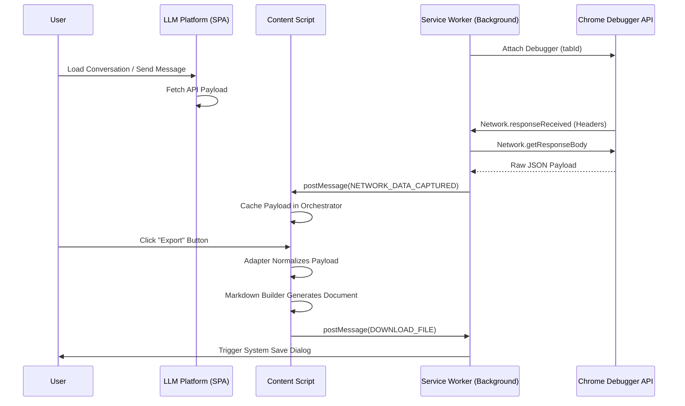
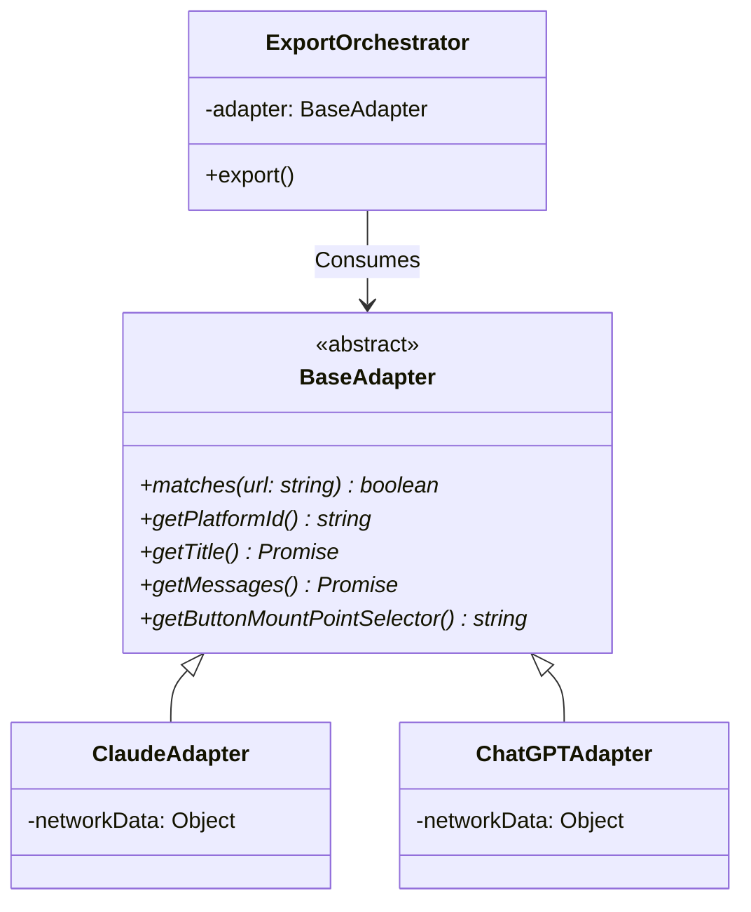

# System Architecture & Technical Documentation

This document outlines the commercial-grade architecture of the **Universal LLM Chat Exporter**. The system is built to be highly scalable, fault-tolerant against frontend UI changes, and easily extensible by distributed teams.

---

## 1. Executive Summary

The Universal LLM Chat Exporter operates as a decentralized orchestration engine within the Chrome browser sandbox. By shifting the extraction vector from **DOM Scraping** (high volatility, high maintenance) to **Network Payload Interception** (low volatility, structured schema), the extension achieves a commercial level of reliability. 

The architecture strictly separates concerns:
- **Transport Layer**: Captures network bytes via CDP.
- **Adapter Layer**: Normalizes proprietary JSON schemas.
- **Core Engine**: Orchestrates execution and formats output.

---

## 2. System Context & Workflow

When a user visits a supported LLM platform, the following lifecycle occurs:



---

## 3. Subsystem Architecture

### 3.1 Network Interception Engine (Service Worker)
Traditional WebExtensions APIs (`chrome.webRequest`) cannot read the response body of a request. To circumvent this, the background worker utilizes the `chrome.debugger` API.
- **Protocol**: Chrome DevTools Protocol (CDP) `Network` domain.
- **Filtering**: Target endpoints are defined via RegExp in `network-interceptor.js`. Filtering happens at the earliest possible stage to minimize memory overhead.
- **State Management**: Captured JSON payloads are cached transiently in a `Map<TabId:PlatformId, JSON>`, preventing memory leaks when tabs are closed.

### 3.2 Polymorphic Adapter Pattern
To support commercial scaling (adding dozens of LLM platforms without spaghetti code), the system employs a strict Adapter pattern.



#### The `ConversationMessage` Standard Schema
Every adapter's primary responsibility is translating a proprietary network payload into this strict internal schema:
```typescript
interface ConversationMessage {
  role: 'user' | 'assistant' | 'system';
  content: string; // The primary Markdown text
  timestamp: string | null; // ISO 8601
  thinking: ThinkingBlock[] | null; 
  attachments: Attachment[] | null;
  model: string | null;
}

interface ThinkingBlock {
  content: string;
  durationMs: number | null;
}
```

### 3.3 Single Page Application (SPA) Resilience
LLM platforms heavily utilize React or Angular. Standard content script execution (`run_at: "document_idle"`) only fires on hard reloads. 
- **The Problem**: Navigating between conversations changes the URL without reloading the page, causing the export button to vanish or export the wrong data.
- **The Solution**: The `content-main.js` script monkey-patches the native browser History API (`pushState` and `replaceState`) and listens for `popstate`. Upon detection, it triggers a UI teardown and re-initialization pipeline.

### 3.4 Parsing Strategies

#### Flat Array Parsing (e.g., Claude)
Claude's `/chat_conversations` endpoint returns a flat array of messages. The `ClaudeApiParser` simply maps over this array, extracting `content` blocks. Extended reasoning is elegantly handled by filtering for `type: "thinking"`.

#### N-ary Tree Parsing (e.g., ChatGPT)
ChatGPT's `/backend-api/conversation` endpoint returns a `mapping` object (an adjacency list representing an N-ary tree), allowing for regenerated responses and branching conversations.
- **Resolution**: `ChatGptApiParser` starts at `current_node` and traverses upwards via the `parent` reference until it hits the root. It then reverses this path to produce a linear array representing the user's active viewport.

---

## 4. Build & Deployment Pipeline

- **Bundler**: Webpack 5 processes and chunks the source code.
  - `service-worker.js` (Background)
  - `content-main.js` (DOM interactions)
  - `popup.js` / `options.js` (Extension UI)
- **Transpilation**: Babel ensures modern ES features (like Optional Chaining and Nullish Coalescing) execute flawlessly on older browser variants.
- **Testing**: Jest runs isolated unit tests. Mock JSON payloads (Fixtures) captured directly from production LLM platforms are committed to `tests/fixtures/`, providing high-confidence regression testing whenever parser logic is updated.

---

## 5. Extensibility Guide: Adding a New Platform

To commercially scale this product, onboard a new platform in 5 steps:
1. **Network Analysis**: Open DevTools on the target platform. Identify the XHR request containing the conversation history.
2. **Interceptor Config**: Add the endpoint's regex to `CONVERSATION_ENDPOINTS` in `src/background/network-interceptor.js`.
3. **Adapter Implementation**: Extend `BaseAdapter` in a new directory (`src/adapters/new-platform/`).
4. **Parser Implementation**: Write a stateless static class to map the intercepted JSON to the `ConversationMessage` schema. Write robust Jest tests for it.
5. **Registry**: Append the new adapter class to `ADAPTER_REGISTRY` inside `src/core/export-orchestrator.js`.
