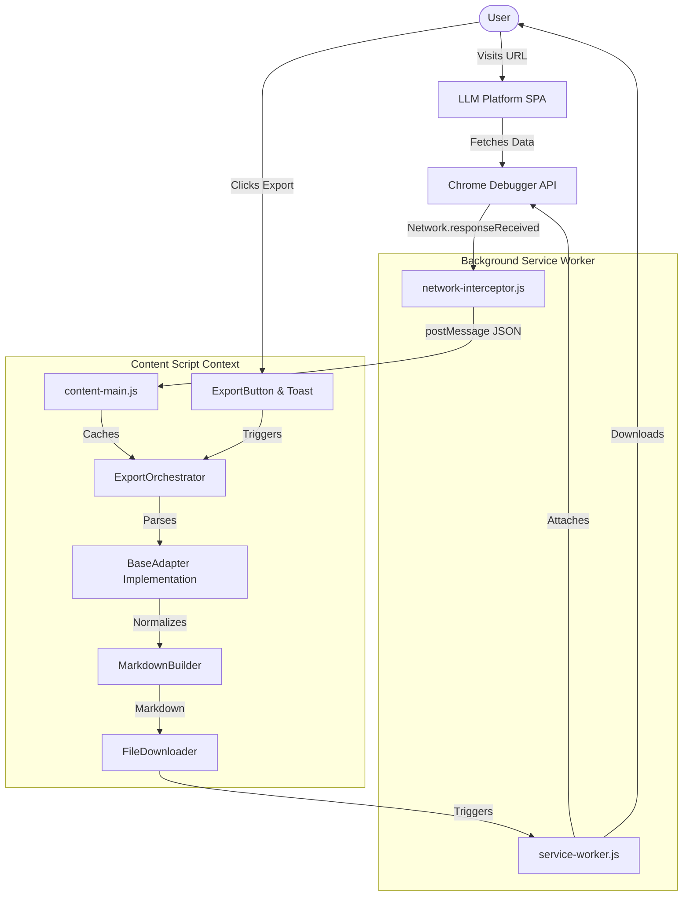

## Overview

The Universal LLM Chat Exporter circumvents volatile DOM scraping by utilizing the Chrome DevTools Protocol to intercept structured JSON payloads directly from backend API requests. The system routes this data into a platform-agnostic formatting pipeline. This ensures absolute extraction accuracy while radically reducing maintenance overhead when LLM platforms alter their frontend interfaces.

## Design Principles

- We chose Network Interception over DOM Scraping because backend API contracts are significantly more stable than frontend CSS classes.
- We chose the Adapter Pattern over branching logic because it cleanly decouples the core export engine from proprietary LLM platform schemas.
- We chose the `chrome.debugger` API over the `chrome.webRequest` API because MV3 `webRequest` lacks the ability to intercept response bodies without routing through an external proxy.
- We chose to monkey-patch the native History API over polling the DOM because it is the most performant way to detect SPA navigations in React/Angular applications.

## System Diagram

## Component Breakdown

### Background Service Worker
- Purpose: Manages the extension lifecycle and orchestrates elevated API calls.
- Responsibilities: 
  - Attaching and detaching the Chrome Debugger to specific tabs.
  - Triggering the native `chrome.downloads` API upon request.
- What it does NOT do: Does not parse JSON schemas or format markdown.
- Key files: `src/background/service-worker.js`.
- Internal dependencies: `network-interceptor.js`.
- External dependencies: `chrome.tabs`, `chrome.runtime`, `chrome.downloads`.

### Network Interceptor
- Purpose: Intercepts raw network payloads from LLM platforms.
- Responsibilities:
  - Filtering HTTP traffic against predefined RegExp endpoints.
  - Extracting response bodies via `Network.getResponseBody`.
  - Caching transient payloads in a Map.
- What it does NOT do: Does not alter or block network traffic.
- Key files: `src/background/network-interceptor.js`.
- Internal dependencies: None.
- External dependencies: `chrome.debugger`.

### Export Orchestrator
- Purpose: Coordinates the extraction and formatting pipeline in the content script.
- Responsibilities:
  - Resolving the correct platform adapter based on the active URL.
  - Applying user configuration from Storage.
  - Executing the pipeline from data ingestion to download.
- What it does NOT do: Does not inject UI elements directly.
- Key files: `src/core/export-orchestrator.js`.
- Internal dependencies: `BaseAdapter`, `MarkdownBuilder`, `FileDownloader`, `Storage`.
- External dependencies: None.

### Platform Adapters
- Purpose: Normalizes proprietary JSON schemas into a standard internal format.
- Responsibilities:
  - Extracting messages, timestamps, and reasoning blocks.
  - Flattening complex tree structures (e.g., ChatGPT's mapping object) into a linear array.
- What it does NOT do: Does not write markdown or handle downloads.
- Key files: `src/adapters/base-adapter.js`, `src/adapters/claude/claude-adapter.js`.
- Internal dependencies: `ClaudeApiParser`, `ChatGptApiParser`.
- External dependencies: None.

## Data Flow

1. The user navigates to an LLM platform (e.g., `https://chatgpt.com/`).
2. The `service-worker.js` detects the URL and calls `network-interceptor.js` to attach to the tab via `chrome.debugger`.
3. The LLM platform fetches conversation history. `network-interceptor.js` captures the JSON body and sends it via `postMessage` to `content-main.js`.
4. `content-main.js` receives the data and caches it within the `ExportOrchestrator` instance.
5. The user clicks the injected Export button (`export-button.js`).
6. `ExportOrchestrator` invokes `Adapter.getMessages()`, which delegates to the specific `ApiParser` (e.g., `ChatGptApiParser`).
7. The parser returns a normalized `ConversationMessage[]` array.
8. `ExportOrchestrator` passes the array to `MarkdownBuilder.build()`, outputting a raw string.
9. `ExportOrchestrator` hands the string to `FileDownloader.download()`.
10. `FileDownloader` creates a blob URL and sends a message back to the `service-worker.js` to invoke `chrome.downloads.download()`.

## Key Design Patterns

### Adapter Pattern
- Name of the pattern: Adapter Pattern.
- Where it is applied: `src/adapters/base-adapter.js` and all platform-specific adapter classes.
- Why it was chosen: It completely isolates proprietary API changes. If ChatGPT changes their schema, only `ChatGptApiParser.js` requires modification.

### Observer Pattern (Mutation)
- Name of the pattern: Observer Pattern.
- Where it is applied: `src/content/ui/export-button.js` (`MutationObserver`).
- Why it was chosen: React/Angular applications frequently re-render the DOM, instantly destroying injected elements. The observer guarantees the export button persists immediately after UI repaints.

## Extension Points

To add a new platform adapter without modifying the core extraction loop, a contributor must:
1. Create `src/adapters/new-platform/new-adapter.js` extending `BaseAdapter`.
2. Implement `static matches(url)`, `getTitle()`, `getMessages()`, and `getPlatformId()`.
3. Add the endpoint URL to the `CONVERSATION_ENDPOINTS` constant in `src/background/network-interceptor.js`.
4. Add the adapter class to `ADAPTER_REGISTRY` in `src/core/export-orchestrator.js`.

## What Was Deliberately Not Built

- **DOM Parsing Fallbacks**: Deliberately excluded. Attempting to parse the DOM when network data fails leads to buggy, fragmented markdown. We enforce a hard requirement on network interception.
- **External Proxy Servers**: Considered to bypass the need for the `debugger` permission, but rejected due to extreme privacy risks and latency introduced by routing user conversation data through third-party servers.

## Performance Characteristics

- Memory Usage: Intercepted payloads are cached transiently. A single conversation JSON rarely exceeds 2MB. The memory map strictly overwrites previous conversations for the same tab to prevent unbounded memory growth.
- Execution Time: Parsing a 100-message tree and compiling markdown occurs entirely synchronously in under 15ms.
- Bottleneck: The native `chrome.downloads.download` API has a slight asynchronous delay (approx 100-200ms) before the system dialog appears.

## Security Model

- Trust Boundaries: The extension executes entirely within the Chrome sandbox. It trusts the authenticated session of the user on the specific LLM platform.
- Data Handling: Intercepted JSON is strictly held in a temporary variable within the V8 isolate. It is NEVER written to local disk (except intentionally by the user via download), `chrome.storage`, or transmitted over the network.
- Explicit Scope: The `debugger` permission is restricted exclusively to the `host_permissions` explicitly listed in `manifest.json`.

*Last updated: 2026-05-30*
